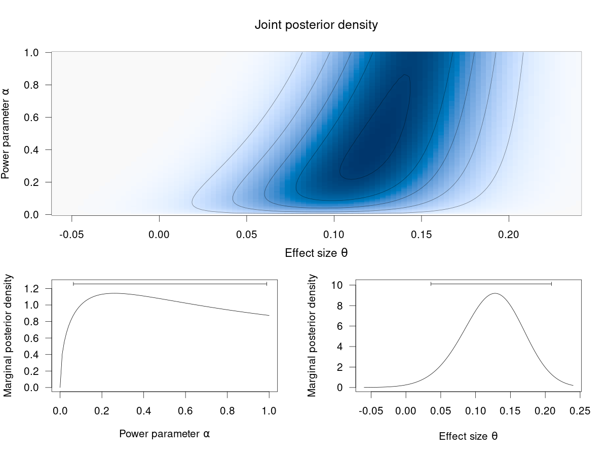

# ppRep

**ppRep** is an R package for Bayesian estimation and testing of effect sizes
based on original and replication study using a power prior framework for
dynamic discounting of the original data. For more information, see the paper

Pawel, S., Aust, F., Held, L., and Wagenmakers, E.-J. (2023). Power priors for
replication studies. TEST.
doi:[10.1007/s11749-023-00888-5](https://doi.org/10.1007/s11749-023-00888-5)

## Installation

```r
## CRAN version
install.packages("ppRep")

## from GitHub
## install.packages("remotes") # requires remotes package
remotes::install_github(repo = "SamCH93/ppRep")
```

## Usage

``` r
library("ppRep")

## data from one replication of "Labels" experiment in Protzko et al. (2020)
to <- 0.2 # original SMD effect estimate
so <- 0.05 # original standard error
tr <- 0.09 # replication SMD effect estimate
sr <- 0.05 # replication standard error

## compute and plot posterior density with 95% HPD credible intervals
plotPP(tr = tr, sr = sr, to = to, so = so, CI = TRUE)
```


<!-- png(filename = "posterior.png", width = 1.5*800, height = 1.5*600, pointsize = 25); plotPP(tr = tr, sr = sr, to = to, so = so, CI = TRUE, ngrid = 1000); dev.off() -->
